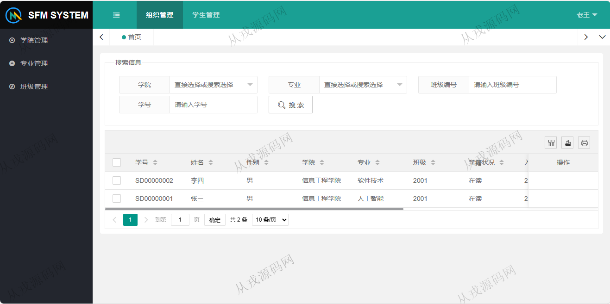
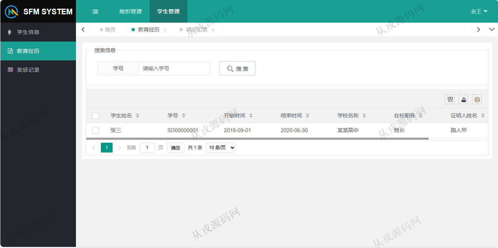
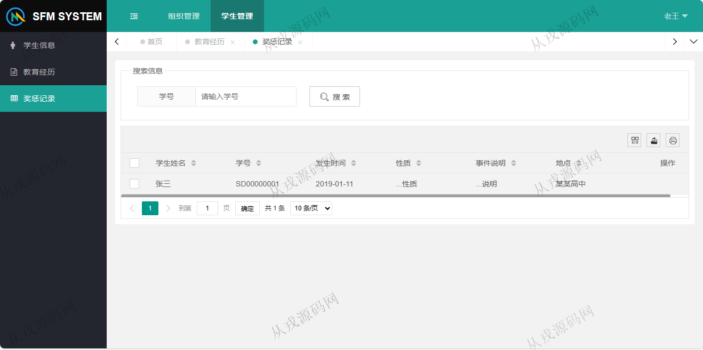
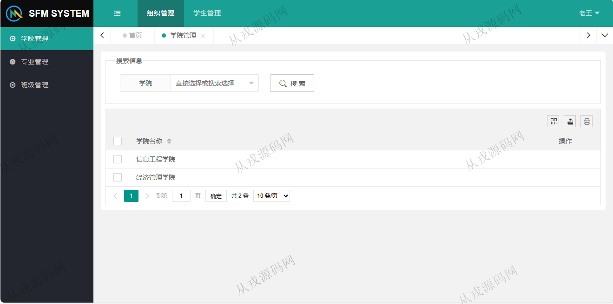
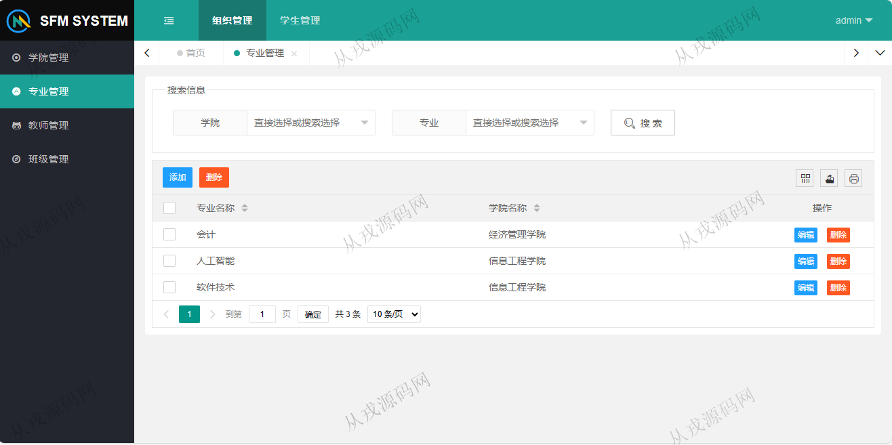
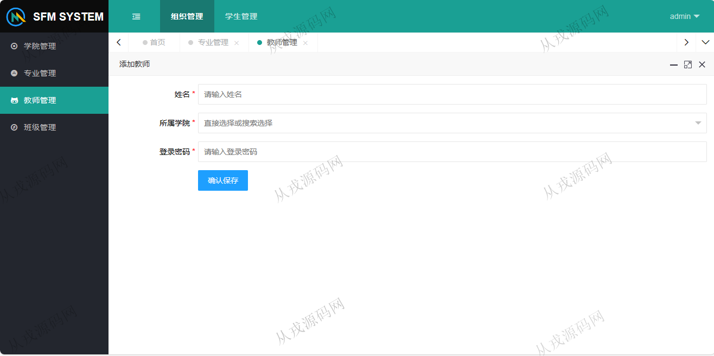
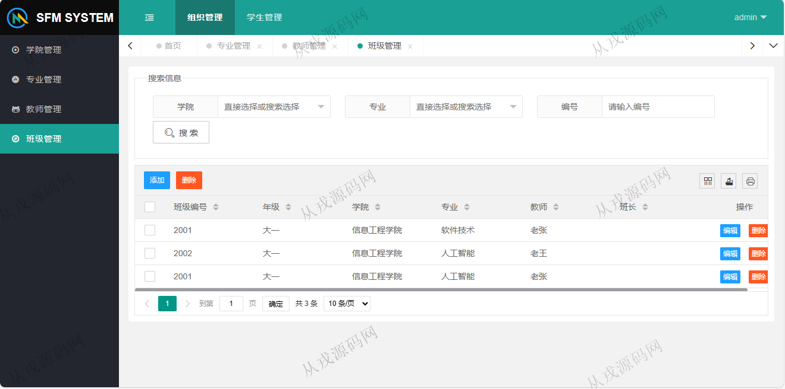
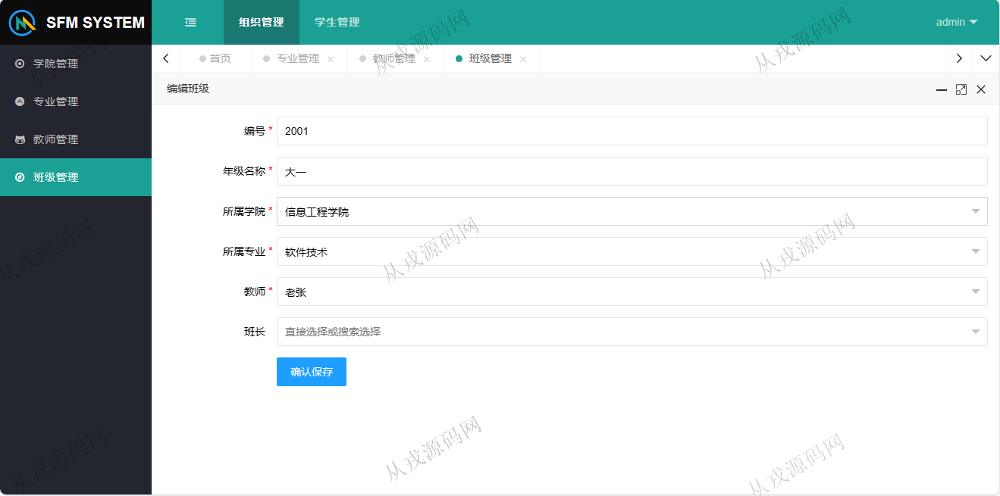

<h1 align="center">114.学生档案管理系统</h1>

 获取sql文件 QQ: 386869957 QQ群: 377586148 

 [推荐站点: 从戎源码网](https://armycodes.com/) 

## 简介

> 本代码来源于网络,仅供学习参考使用!
>
> 提供1.远程部署/2.修改代码/3.设计文档指导/4.框架代码讲解等服务
> 
> 访问地址：http://localhost:8080/
> 
> 管理员：admin 123456
> 
> 学生：SD00000001 123456
> 
> 老师：TC0001 123456
> 

## 项目介绍
基于springboot的学生档案管理系统：前端 thymeleaf、jquery、layui，后端 maven、springmvc、spring、mybatis、security，角色分为管理员、学生、老师；集成教育经历，奖惩记录，专业管理等功能于一体的系统。

## 功能介绍

### 管理员

- 学院管理：学院信息的增删改查，搜索
- 专业管理：专业信息的增删改查，多条件搜索查询
- 教师管理：教师信息的增删改查，多条件搜索查询
- 班级管理：班级信息的增删改查，多条件搜索查询

### 老师

- 学院管理：学院信息的列表查询，搜索
- 专业管理：专业信息的列表查询，多条件搜索查询
- 班级管理：班级信息的列表查询，多条件搜索查询

### 学生

- 教育经历：经历列表查询
- 奖惩记录：奖惩记录列表查询

## 环境

- <b>IntelliJ IDEA 2021.3</b>

- <b>Mysql 5.7.26</b>

- <b>JDK 1.8</b>

## 运行截图

